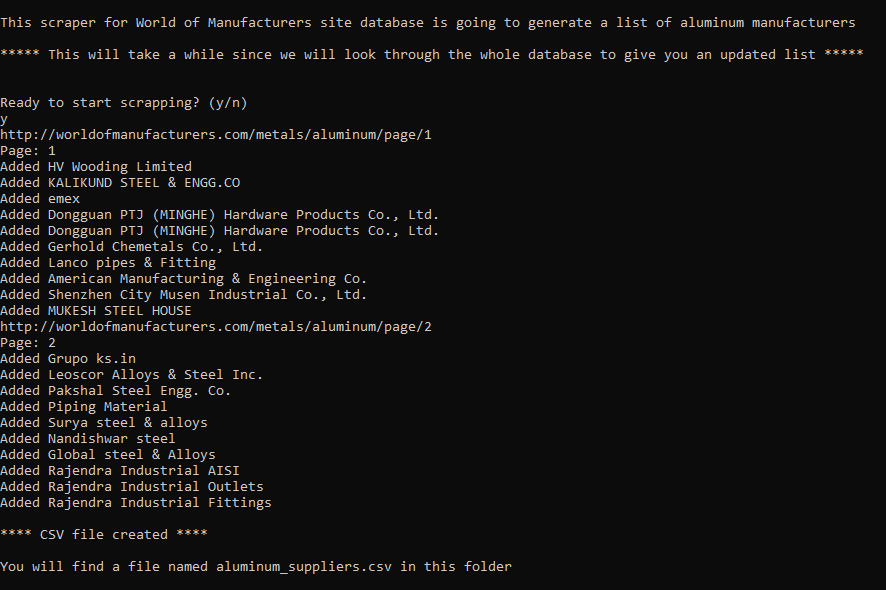

# Web Scraper for Aluminum Manufacturers

This scraper will look for aluminum manufacturers in the huge database of [World of Manufacturers](https://worldofmanufacturers.com) and will generate a list to make easy the task of traders and whoever interested on this kind of data.

## Live version

## Built with

- Ruby

## Features

- **Full database scraper.** This scraper will collect data from the whole database of World of Manufacturers.
- **Visual process progress.** The user will be able to see on the screen what the scraper is doing and check if theres any problem or if the process is finished.
- **CSV generator.** All the data will be stored in a CSV file so the user can manipulate the list of providers in any spreadsheet editor or viewer like Excel, for instance.

## How to use it

- Once the program is excuted just follow the instructions on screen. (See below in Installation about how to execute the program.)
- After the scraper is done storing data, a csv file will be created in the same folder where you are executing the program, usually `Web-Scraper-Ruby/bin`

## Installation

1. Push on the green button that says "Code". You will see it in this repository landing page. It will open a menu with the option "Download ZIP". Click on it and proceed to save the file on your computer.
2. Extract the files in the ZIP file in your desired destination folder.
3. Open the terminal and go to the folder where you have extracted the files.
4. Once in the main folder insert `cd bin`
5. Here you have to insert `./main.rb` to execute the game and follow the instrucions on screen.

## Testing with RSpec

For professional users: RSpec tests have been included to check to correct functioning of the program.
For accessing the RSpec tests follow the previous step 'Installation' must be completed. The you can follow these steps:

1. Install the RSpec gem by entering `gem install rspec`
2. Go to the main directory `Web-Scraper-Ruby`
3. Type `rspec` and press Enter. The tests will be displayed on your screen.
  
- The tests files are stored in the spec folder.

## Author

👤 **Daniel Duran**

- GitHub: [Daniduran-dev](https://github.com/Daniduran-dev)

## 📝License

This project is [MIT](https://opensource.org/licenses/MIT) licensed.
